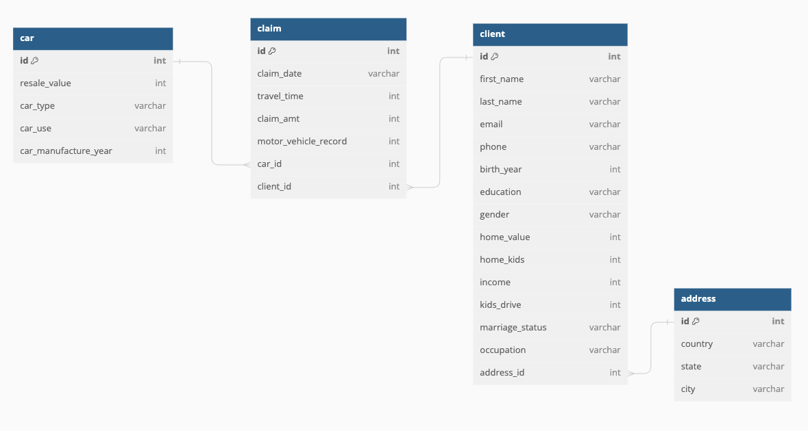
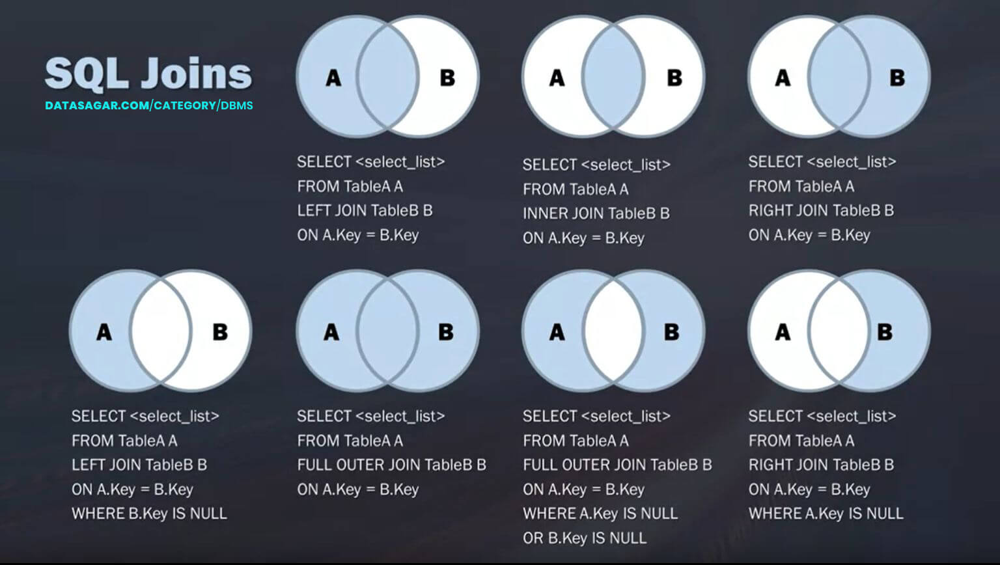

# Lesson

## Brief

### Lesson Overview

This lesson introduces advanced query and statements. Learners will be able to use meta queries to retrieve information about the database, use joins and unions to combine data from multiple tables, use window functions to calculate aggregates over a set of rows, use subqueries, and apply common table expressions to create temporary tables.

---

## Part 1 - Meta queries

Open DBeaver and create a new connection to the DuckDB database file `db/unit-1-5.db`.

The tables we will be using are in the `main` (default) schema.

### List and describe tables

To list all the tables in `main`, run the following query:

```sql
SHOW TABLES;
```

You should see 4 rows of data. Each row represents the name of a table in the schema:

- `address`
- `car`
- `claim`
- `client`

If you want to see more details, run:

```sql
SHOW ALL TABLES;
```

To view the schema of an individual table, use the `DESCRIBE` command.

```sql
DESCRIBE address;
```

You should see the column names and data types.

> Describe the other 3 tables. Study their column names and data types.

### Summarize tables

You can use the `SUMMARIZE` command to launch a query that computes a number of aggregates over all columns (of a table or query), including min, max, avg, std and approx_unique.

```sql
SUMMARIZE address;
```

> Summarize the other 3 tables. Study their min, max, approx_unique, avg and std (if applicable).

## Part 2 - Joins and Unions

Joins are used to combine data from multiple tables. They are useful when you want to query data that is spread across multiple tables. You can join tables based on a common column, usually the _primary key_ of one table and the _foreign key_ of another table.

Let's look at the ERD of the database:

```dbml
Table claim {
  id int [pk]
  claim_date varchar
  travel_time int
  claim_amt int
  motor_vehicle_record int
  car_id int
  client_id int
}

Table car {
  id int [pk]
  resale_value int
  car_type varchar
  car_use varchar
  car_manufacture_year int
}

Table client {
  id int [pk]
  first_name varchar
  last_name varchar
  email varchar
  phone varchar
  birth_year int
  education varchar
  gender varchar
  home_value int
  home_kids int
  income int
  kids_drive int
  marriage_status varchar
  occupation varchar
  address_id int
}

Table address {
  id int [pk]
  country varchar
  state varchar
  city varchar
}


Ref: claim.car_id > car.id

Ref: claim.client_id > client.id

Ref: client.address_id > address.id
```



`car_id`, `client_id` and `address_id` are foreign keys.

The 4 common types of joins are:

- Inner join
- Left join
- Right join
- Full join

### Inner join

An inner join returns only the rows that match in both tables.

```sql
SELECT *
FROM claim
INNER JOIN car ON claim.car_id = car.id;
```

You can also use the `JOIN` keyword instead of `INNER JOIN`. They are the same. But it's good practice to use `INNER JOIN` to make your query more readable.

> Inner join claim and client.
>
> Inner join client and address.

### Left join

A left join returns all the rows from the left table, and the matching rows from the right table.

```sql
SELECT *
FROM claim
LEFT JOIN car ON claim.car_id = car.id;
```

### Right join

A right join returns all the rows from the right table, and the matching rows from the left table.

```sql
SELECT *
FROM claim
RIGHT JOIN car ON claim.car_id = car.id;
```

### Full (outer) join

A full join returns all the rows from both tables.

```sql
SELECT *
FROM claim
FULL JOIN car ON claim.car_id = car.id;
```

An overview of the different types of joins:




> Return a joined table containing `id, claim_date, travel_time, claim_amt` from claim, `car_type, car_use` from car, `first_name, last_name` from client and `state, city` from address.

### Cross join

A cross join returns the Cartesian product of the two tables. It is not useful for this database, but assuming we have an employees table with the following columns:

- id
- name

And a departments table with the following columns:

- id
- name
- manager_id

We can use a cross join to find all the possible combinations of employees and departments:

```sql
SELECT e.name AS employee_name, d.name AS department_name
FROM employees e
CROSS JOIN departments d;
```

### Self join

A self join is a join where a table is joined to itself. This is useful when you want to compare rows within the same table. It is not useful for this database, but assuming we have an employees table with the following columns:

- id
- name
- manager_id

We can use a self join to find the manager of each employee:

```sql
SELECT e1.name AS employee_name, e2.name AS manager_name
FROM employees e1
INNER JOIN employees e2 ON e1.manager_id = e2.id;
```

The `e1` and `e2` are aliases for the table. They are used to distinguish the two instances of the same table.

### Union

A union combines the results of two or more tables or queries into a single result set. The queries must have the same number of columns and compatible data types.

It is not useful for this database, but assuming we have an employees table with the following columns:

- id
- name
- email
- phone

And a contractors table with the same columns. We can use a union to combine the two tables:

```sql
SELECT *
FROM employees
UNION
SELECT *
FROM contractors;
```

`UNION` removes duplicate rows. If you want to keep duplicate rows, use `UNION ALL` instead.

## Part 3 - Window functions

Window functions are used to compute aggregates over a group of rows, called a window. They are useful when you want to compute aggregates over a group of rows, but you don't want to group the rows into a single output row. For example, you can use window functions to compute the running total of a column. You can also use window functions to compute the rank of a row. Window functions are also called analytical functions.

### Running total

A running total is the sum of values in a column, where the sum is accumulated over time. For example, the running total of the following column:

```
1
2
3
4
```

is:

```
1
3
6
10
```

You can use the `SUM` window function to compute the running total of a column. The `SUM` window function takes a column as input, and returns the sum of the column values in the current row and all previous rows.

```sql
SELECT
  id, claim_amt,
  SUM(claim_amt) OVER (ORDER BY id) AS running_total
FROM claim;
```

The `OVER` clause defines the window. The `ORDER BY` clause defines the order of the rows in the window. The `SUM` window function computes the running total of the `claim_amt` column.

`PARTITION BY` can be used to define the groups in the window. For example, if we want to compute the running total of the `claim_amt` column for each `car_id`:

```sql
SELECT
  id, car_id, claim_amt,
  SUM(claim_amt) OVER (PARTITION BY car_id ORDER BY id) AS running_total
FROM claim;
```

> Return a table containing `id, car_id, travel_time, running_total` from claim, where `running_total` is the running sum of the `travel_time` column for each `car_id`.

### Rank

The `RANK` window function computes the rank of a row in an ordered window. The rank of a row is the number of rows that come before the row, plus one. For example, the rank of the following column:

```
a
b
c
d
```

is:

```
1
2
3
4
```

You can use the `RANK` window function to compute the rank of a row. The `RANK` window function takes a column as input, and returns the rank of the column value in the current row.

```sql
SELECT
  id, car_id, claim_amt,
  RANK() OVER (PARTITION BY car_id ORDER BY claim_amt DESC) AS rank
FROM claim;
```

The `OVER` clause defines the window. The `PARTITION BY` clause defines the groups in the window. The `ORDER BY` clause defines the order of the rows in the window. The `RANK` window function computes the rank of the `claim_amt` column. It gives the same rank to rows with the same column value (`claim_amt`).

To return a different rank for each row, use the `ROW_NUMBER` window function instead.

> Return a table containing `id, car_id, travel_time, rank` from claim, where `rank` is the rank of the `travel_time` in descending order for each `car_id`.

### Qualify

The `QUALIFY` clause is used to filter rows in a window. It is useful when you want to filter rows based on the result of a window function. For example, if we want to return the rows with a rank of 1:

```sql
SELECT
  id, car_id, claim_amt,
  RANK() OVER (PARTITION BY car_id ORDER BY claim_amt DESC) AS rank
FROM claim
QUALIFY rank = 1;
```

The `QUALIFY` clause filters the rows in the window. It keeps the rows where the rank is equal to 1.

> Return a table containing `id, car_id, travel_time, rank` from claim, where `rank` is the rank of the `travel_time` in descending order for each `car_id`, and only return the rows with a rank of 1.

## Part 4 - Subqueries

A subquery is a query nested inside another query. It is useful when you want to use the result of a query as input to another query.

For example, if we want to find the cars that have been involved in a claim:

```sql
SELECT id, resale_value, car_type
FROM car
WHERE id IN (
  SELECT DISTINCT car_id
  FROM claim
);
```

### Correlated subquery

A correlated subquery is a subquery that references a column from the outer query. It is useful when you want to use the result of a query as input to another query, and the inner query depends on the outer query. The subquery is evaluated once for each row processed by the outer query.

For example, if we want to find the cars that have been involved in a claim, and the claim amount is greater than 10% of the car's resale value:

```sql
SELECT id, resale_value, car_type
FROM car c
WHERE id IN (
  SELECT DISTINCT car_id
  FROM claim
  WHERE claim_amt > 0.1 * c.resale_value
);
```

You can use the `EXISTS` operator to check if a subquery returns any rows. It is useful when you want to check if a subquery returns any rows, and the result of the query doesn't matter.

For example, if we want to find the cars that have been involved in a claim:

```sql
SELECT id, resale_value, car_type
FROM car c1
WHERE EXISTS (
  SELECT DISTINCT car_id
  FROM claim c2
  WHERE c2.car_id = c1.id
);
```

The `EXISTS` operator returns true if the subquery returns any rows, and false otherwise.

### Subquery in FROM

A subquery in the `FROM` clause is called a derived table. It is useful when you want to use the result of a query as a table.

For example, if we want to find the cars that have been involved in a claim, and the car resale value is less than the average resale value for the car type:

```sql
SELECT id, resale_value, c1.car_type
FROM car c1
INNER JOIN (
  SELECT car_type, AVG(resale_value) AS average_resale_value
  FROM car
  GROUP BY car_type
) c2 ON c1.car_type = c2.car_type
WHERE resale_value < average_resale_value;
```

The derived table is useful when you want to use the result of a query as a table.

> Return a table containing `id, resale_value, car_use` from car, where the car resale value is less than the average resale value for the car use.

## Part 5 - Common Table Expressions

A common table expression (CTE) is a named subquery. It is useful when you want to use the result of a query as input to another query, and the subquery is used more than once. The CTE is evaluated once, and the result is stored in a temporary table. The temporary table can be referenced in the query.

Using the same example as above:

```sql
WITH avg_resale_value_by_car_type AS (
  SELECT car_type, AVG(resale_value) AS average_resale_value
  FROM car
  GROUP BY car_type
)
SELECT id, resale_value, c1.car_type
FROM car c1
INNER JOIN avg_resale_value_by_car_type c2 ON c1.car_type = c2.car_type
WHERE resale_value < average_resale_value;
```

> Return a table using CTE containing `id, resale_value, car_use` from car, where the car resale value is less than the average resale value for the car use.
